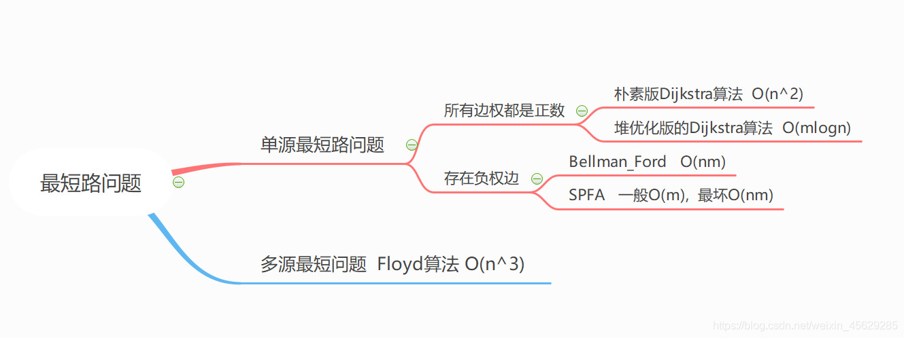
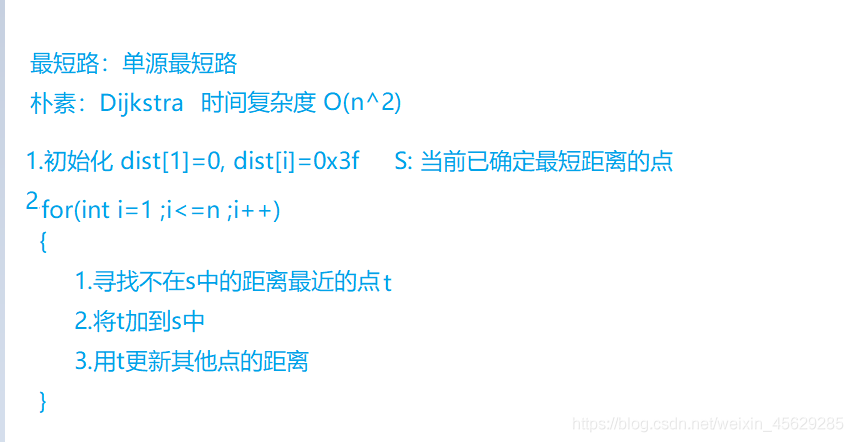
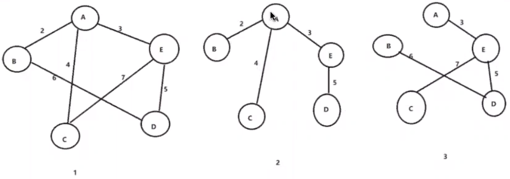

## 数组

### `vector`

#### 定义和初始化

```cpp
(1)vector<int> a(10); //定义了10个整型元素的向量（尖括号中为元素类型名，它可以是任何合法的数据类型），但没有给出初值，其值是不确定的。
(2)vector<int> a(10,1); //定义了10个整型元素的向量,且给出每个元素的初值为1
(3)vector<int> a(b); //用b向量来创建a向量，整体复制性赋值
(4)vector<int> a(b.begin(),b.begin+3); //定义了a值为b中第0个到第2个（共3个）元素
(5)int b[7]={1,2,3,4,5,9,8};
vector<int> a(b,b+7); //从数组中获得初值
```

#### 常用的函数

```cpp
(1)a.assign(b.begin(), b.begin() + 3); //b为向量，将b的0~2个元素构成的向量赋给a
(2)a.assign(4, 2); //是a只含4个元素，且每个元素为2
(3)a.back(); //返回a的最后一个元素
(4)a.front(); //返回a的第一个元素
(5)a[i]; //返回a的第i个元素，当且仅当a[i]存在2013-12-07
(6)a.clear(); //清空a中的元素
(7)a.empty(); //判断a是否为空，空则返回ture,不空则返回false
(8)a.pop_back(); //删除a向量的最后一个元素
(9)a.erase(a.begin() + 1, a.begin() + 3); //删除a中第1个（从第0个算起）到第2个元素，也就是说删除的元素从a.begin()+1算起（包括它）一直到a.begin() + 3（不包括它）
(10)a.push_back(5); //在a的最后一个向量后插入一个元素，其值为5
(11)a.insert(a.begin() + 1, 5); //在a的第1个元素（从第0个算起）的位置插入数值5，如a为1,2,3,4，插入元素后为1,5,2,3,4
(12)a.insert(a.begin() + 1, 3, 5); //在a的第1个元素（从第0个算起）的位置插入3个数，其值都为5
(13)a.insert(a.begin() + 1, b + 3, b + 6); //b为数组，在a的第1个元素（从第0个算起）的位置插入b的第3个元素到第5个元素（不包括b+6），如b为1,2,3,4,5,9,8，插入元素后为1,4,5,9,2,3,4,5,9,8
(14)a.size(); //返回a中元素的个数；
(15)a.capacity(); //返回a在内存中总共可以容纳的元素个数
(16)a.resize(10); //将a的现有元素个数调至10个，多则删，少则补，其值随机
(17)a.resize(10, 2); //将a的现有元素个数调至10个，多则删，少则补，其值为2
(18)a.reserve(100); //将a的容量（capacity）扩充至100，也就是说现在测试a.capacity();的时候返回值是100.这种操作只有在需要给a添加大量数据的时候才显得有意义，因为这将避免内存多次容量扩充操作（当a的容量不足时电脑会自动扩容，当然这必然降低性能） 
```

#### 遍历方式

1. 普通遍历

```cpp
for (int i = 0; i < a.size(); i++) cout << a[i] << ' ';
```

2. 迭代器遍历

```cpp
for (auto i = a.begin(); i != a.end(); i++) cout << *i << ' ';
```

3. 基于for循环的范围遍历

```cpp
for (auto x : a ) cout << x << ' ';
```

#### 重要算法

```cpp
头文件#include<algorithm>
(1)sort(a.begin(), a.end()); //对a中的从a.begin()（包括它）到a.end()（不包括它）的元素进行从小到大排列
(2)reverse(a.begin(), a.end()); //对a中的从a.begin()（包括它）到a.end()（不包括它）的元素倒置，但不排列，如a中元素为1,3,2,4,倒置后为4,2,3,1
(3)copy(a.begin(), a.end(), b.begin() + 1); //把a中的从a.begin()（包括它）到a.end()（不包括它）的元素复制到b中，从b.begin()+1的位置（包括它）开始复制，覆盖掉原有元素
(4)find(a.begin(), a.end(), 10); //在a中的从a.begin()（包括它）到a.end()（不包括它）的元素中查找10，若存在返回其在向量中的位置
```

#### vector的扩容机制

`STL`中的`vector`是封装了动态数组的顺序容器。不过与动态数组不同的是，`vector`可以根据需要自动扩大容器的大小。具体策略是每次容量不够用时重新申请一块大小为原来容量两倍的内存，将原容器的元素拷贝至新容器，并释放原空间，返回新空间的指针。
在原来空间不够存储新值时，每次调用push_back方法都会重新分配新的空间以满足新数据的添加操作。如果在程序中频繁进行这种操作，还是比较消耗性能的。

## 链表

### 单链表

链表节点：

```cpp
struct Node {
    int val;
    Node* next;
    Node():val(0), next(nullptr){}
    Node(int val):val(val), next(nullptr){}
}
```

### 双链表`list`

#### 定义和初始化

```cpp
 list<int>lst1;          //创建空list
 list<int> lst2(5);       //创建含有5个元素的list
 list<int>lst3(3,2);  //创建含有3个元素的list
 list<int>lst4(lst2);    //使用lst2初始化lst4
 list<int>lst5(lst2.begin(),lst2.end());  //同lst4
```

#### 常用操作函数

```cpp
Lst1.assign() 给list赋值 
Lst1.back() 返回最后一个元素 
Lst1.begin() 返回指向第一个元素的迭代器 
Lst1.clear() 删除所有元素 
Lst1.empty() 如果list是空的则返回true 
Lst1.end() 返回末尾的迭代器 
Lst1.erase() 删除一个元素 
Lst1.front() 返回第一个元素 
Lst1.insert() 插入一个元素到list中 
Lst1.pop_back() 删除最后一个元素 
Lst1.pop_front() 删除第一个元素 
Lst1.push_back() 在list的末尾添加一个元素 
Lst1.push_front() 在list的头部添加一个元素 
Lst1.rbegin() 返回指向第一个元素的逆向迭代器 
Lst1.rend() 指向list末尾的逆向迭代器 
Lst1.resize() 改变list的大小 
Lst1.reverse() 把list的元素倒转 
Lst1.size() 返回list中的元素个数 
Lst1.sort() 给list排序 
Lst1.unique() 删除list中重复的元素
```

#### 遍历方式

```cpp
 for (list<int>::const_iterator iter = lst1.begin(); iter != lst1.end(); iter++) {
      cout<<*iter;
 }
```

## 字符串

### `string`

#### 定义和初始化

初始化有两种方式，其中使用等号的是拷贝初始化，不使用等号的是直接初始化。

```cpp
string str1 = "hello world";      // str1 = "hello world"
string str2("hello world");       // str2 = "hello world"
string str3 = str1;               // str3 = "hello world"
string str4(str2);                // str4 = "hello world"
string str5(10,'h');              // str5 = "hhhhhhhhhh"
string str6 = string(10,'h');     // str6 = "hhhhhhhhhh"
string str7(str1,6);              // str7 = "world"     从字符串str1第6个字符开始到结束，拷贝到str7中
string str8 = string(str1,6);     // str8 = "world"
string str9(str1,0,5);            // str9 = "hello"     从字符串str1第0个字符开始，拷贝5个字符到str9中
string str10 = string(str1,0,5);  // str10 = "hello"
char c[] = "hello world";
string str11(c,5);                // str11 = "hello"    将字符数组c的前5个字符拷贝到str11中
string str12 = string(c,5);       // str12 = "hello"
```

#### 常用的操作函数

```cpp
(1)str1.size()获取字符串长度
(2)insert函数的使用
string str = "hello world";
string str2 = "hard ";
string str3 = "it is so happy wow";
//s.insert(pos,n,ch)        在字符串s的pos位置上面插入n个字符ch
str.insert(6,4,'z');        // str = "hello zzzzworld"
//s.insert(pos,str)         在字符串s的pos位置插入字符串str
str.insert(6,str2);         // str = "hello hard world"

//s.insert(pos,str,a,n)     在字符串s的pos位置插入字符串str中位置a到后面的n个字符
str.insert(6,str3,6,9);     // str = "hello so happy world"

//s.insert(pos,cstr,n)      在字符串s的pos位置插入字符数组cstr从开始到后面的n个字符
//此处不可将"it is so happy wow"替换为str3
str.insert(6,"it is so happy wow",6);       // str = "hello it is world"
str.insert(str.begin() + 5,','); //在str的第5位的后面插入“,” 
(3)erase函数的使用
string str = "welcome to my blog";
//s.erase(pos, n)           把字符串s从pos开始的n个字符删除
str.erase(11, 3);           // str = "welcome to blog"
(4)substr函数的使用
string str = "The apple thinks apple is delicious";
//s.substr(pos,n)                      得到字符串s位置为pos后面的n个字符组成的串
string s1 = str.substr(4, 5);           // s1 = "apple"
//s.substr(pos)                        得到字符串s从pos到结尾的串
string s2 = str.substr(17);            // s2 = "apple is delicious"
(5)swap函数的使用
string str1 = "small leaf";
string str2 = "big leaf";
//或者str1.swap(str2)  ,输出结果相同
swap(str1,str2);        // str1 = "big leaf"     str2 = "small leaf"
swap(str1[0],str1[1]);  // str1 = "ibg leaf"
(6)数值转换
to_string(val)	      //把val转换成string
stoi(s)	          //把字符串s转换int
stol(s)	          //把字符串s转换成long
(7)find函数的使用
string中find()返回值是字母在母串中的位置（下标记录），如果没有找到，那么会返回一个特别的标记npos，也就是-1。（返回值可以看成是一个int型的数）
string str = "The apple thinks apple is delicious";     //长度34
string key = "apple";
//s.find(str)            查找字符串str在当前字符串s中第一次出现的位置
int pos1 = str.find(key);                  // 4
//s.find(str,pos)        查找字符串str在当前字符串s的[pos,end]中第一次出现的位置
int pos2 = str.find(key, 10);              // 17
//s.find(cstr,pos,n)     查找字符数组cstr前n的字符在当前字符串s的[pos,end]中第一次出现的位置
//此处不可将"delete"替换为str2（如果定义str2 = "delete"）
int pos3 = str.find("delete", 0, 2);       // 26
//s.find(ch,pos)         查找字符ch在当前字符串s的[pos,end]中第一次出现的位置
int pos4 = str.find('s', 0);
```

#### string类的实现

```cpp
#ifndef __MYSTRING__
#define __MYSTRING__

#include <cstring>
#include <iostream>

class String {
public:
	String(const char* cstr = 0);			// 构造函数
	String(const String& str);				// 拷贝构造函数
	String(String&& str);					// 移动构造函数
	String& operator=(const String& str);	// 拷贝赋值函数
	~String();								// 析构函数
	char* get_c_str() const { return m_data; }
private:
	char* m_data;
};

// 构造函数
inline String::String(const char* cstr) {
	if (cstr) {
		m_data = new char[strlen(cstr) + 1];
		strcpy(m_data, cstr);
	} else {
		m_data = new char[1];
		*m_data = '\0';
	}
}
// 拷贝构造函数
inline String::String(const String& str) {
	m_data = new char[strlen(str.m_data) + 1];
	strcpy(m_data, str.m_data);
}
// 移动构造函数
inline String::String(String&& str) : m_data(str.m_data) {
	str.m_data = nullptr;
}
// 拷贝赋值函数
inline String& String::operator=(const String& str) {
	if (this == &str) {
		return *this;
	}
	delete[] m_data;
	m_data = new char[strlen(str.m_data) + 1];
	strcpy(m_data, str.m_data);
	return *this;
}
// 析构函数
inline String::~String() {
	delete[] m_data;//这里一定要delete[]，因为new出来是一个指针数组
}
// 输出操作符重载需设置成非成员函数
std::ostream& operator<<(std::ostream& os, const String& str) {
	os << str.get_c_str();
	return os;
}
#endif
```

### 字符串函数的实现

#### `strcpy`函数的实现

```cpp
char * strcpy(char* strDest, char* strSrc) {
    //断言判空
    assert((str1 != NULL && str2 != NULL));
    //考虑相等，直接返回；
    if (strDest == strStc) return;
    char* address = strDest;
    // 计算字符串长度+‘\0’
    size_t size = strlen(strSrc) + 1;
    // 无内存重叠，正常复制
    if (strDest < strSrc || strDest >= srcSrc + size) {
        while ((*strDest++ = *strSrc++) != '\0');
    } else {
    //有内存重叠高处复制
        char* d = strDest + size - 1;
        char* s = strSrc + size - 1;
        while (size--) {
            *d-- = *s--;
        }
    }
    return address;
}
```

####  `memcpy`函数的实现

```cpp
// 考虑内存重叠
void* Memcpy(void *dst,const void *src,size_t len){
    if(dst == nullptr || src == nullptr)
        return nullptr;
    // reptr保存dst返回值
    void * retpr = dst;
    // 无内存重叠，低地址开始复制 dst < src || src + size <= dst
    if(dst <= src|| ((char*)dst) >= (char*)src+len) {
        while(len--) {
            *(char*)dst = *(char*)src;
            dst = (char*)dst+1;
            src = (char*)src+1;
        }
    } else {
        // 有内存重叠，高地址开始复制
        src = (char*)src+len-1;
        dst = (char*)dst+len-1;
        while(len--) {
            *(char*)dst = *(char*)src;
            dst = (char*)dst-1;
            src = (char*)src-1;
        }
    }
    return retpr;
}
```

> 关于memcpy，要注意。
> 1.参数和返回类型都是void*，不要写char*
> 2.第三个参数别写int，一定要写size_t(size_t在64位是long型 占8字节，而在32字节是unsigned int型 占4位)
> 3.函数体内一定要将void转换为char，因为要保证是按字节copy的。

#### `strcmp`函数的实现

> while遇到'\0'会退出循环
> `str1 == str2` 返回零
> `str1 > str2` 返回正数
> `str1 < str2` 返回负数

```cpp
int strcmp(char* str1, char* str2) {
    assert(str1 != NULL && str2 != NULL);
    while ((*str1) && (*str2) && (*str1 == *str2)) {
        str1++;
        str2++;
    }
    return *str1 - *str2;
}
```

#### `strcat`函数的实现

`c_str()`方法是`const char*`常量指针（即可读不可改变），指向的内容不可以更改。

```cpp
char* strcat(char* str1, char* str2) {
    assert((str1 != NULL && str2 != NULL));
    char* ret = str1;
    while (*str1 != '\0') str1++;
    while ((*str1 = *str2) != '\0') {
        str1++;
        str2++;
    };
    return ret;
}
```

#### `strlen`函数的实现

```cpp
int strlen(char* str1) {
    assert(str1 != NULL);
    int len = 0;
    while (*str1 != '\0') {
        len++;
        str1++;
    }
    return len;
}
```

### `KMP`算法

1. s模式串(长)
2. p模板串(短)
3. `next`存储每一个下标对应的部分匹配值。

`next`数组的含义：对`next[j] `，是`p[1, j]`串中前缀和后缀相同的最大长度（部分匹配值）。


(1) 求next数组的思路


```cpp
for(int i = 2, j = 0; i <= m; i++) {
    while(j && p[i] != p[j+1]) j = next[j];
    if(p[i] == p[j+1]) j++;
    next[i] = j;
}
```

> 注意点：i = 2是因为这样当前匹配的话才会有公共前后缀。

(2)匹配字符串

**s串 和 p串都是从1开始的。i 从1开始，j 从0开始，每次s[i] 和p[j + 1]比较**。


`s[a, b] = p[1, j] && s[i] != p[j + 1] `,此时要移动p串(直接移动到下次能匹配的位置)。

1串：`[1, next[j]]`

3串：`[j - next[j] + 1, j]`

1串等于3串，3串等于2串。

所以直接移动p串从1串的位置移动到3串的位置。该操作可由`j = next[j]`直接完成。

如此往复直到`j == m`匹配成功。

```cpp
for(int i = 1, j = 0; i <= n; i++) {
    //如果j有对应p串的元素， 且s[i] != p[j+1], 则失配， 移动p串
    //用while是由于移动后可能仍然失配，所以要继续移动直到匹配或整个p串移到后面（j = 0)
    while(j && s[i] != p[j+1]) j = next[j];//while里的判断条件j是指j退无可退的时候，跳出循环
    if(s[i] == p[j+1]) j++;
    //当前元素匹配，j移向p串下一位
    if(j == m) {
        //匹配成功，进行相关操作
        j = next[j];  //继续匹配下一个子串
    }
}
```

整体代码:

```cpp
#include<iostream>
using namespace std;
const int M = 1000010;
const int N = 100010;
char s[M];
char p[N];
int ne[N];

int main() {
    ios::sync_with_stdio(false);
    cin.tie(0);
    int n, m;
    cin >> n >> p + 1 >> m >> s + 1;  //小技巧字符串输入从下标1开始输入
    //获取next数组
    for (int i = 2, j = 0; i <= n; i++) {
        while (j && p[i] != p[j + 1]) j = ne[j];
        if (p[i] == p[j + 1]) j++; //为什么这里不用&&j，'&&j'的话就跳过第一次匹配了。
        ne[i] = j;
    }
    //模式匹配
    for (int i = 1, j = 0; i <= m; i++) {
        while (j && s[i] != p[j + 1]) j = ne[j];
        if (s[i] == p[j + 1]) j++;
        if ( j == n) {
            cout << i - n << " ";
            j = ne[j];
        }
    }
    return 0;
}
```

## 树

### 二叉树

#### 二叉树的种类
完全二叉树：除最后一层外，每一层上的结点数均达到最大值；在最后一层上只缺少右边的若干结点。
满二叉树：除最后一层无任何子节点外，每一层上的所有结点都有两个子结点的二叉树。
二叉搜索树：可以为空树，或者是具备如下性质：若它的左子树不空，则左子树上的所有结点的值均小于根节点的值；若它的右子树不空，则右子树上的所有结点的值均大于根节点的值，左右子树分别为二叉排序树。
平衡二叉树：它是一个空树或它的左右两个子树的高度差的绝对值不超过1，并且左右两个子树都是平衡二叉树，如果插入或者删除一个节点使得高度之差大于1，就要进行节点之间的旋转，将二叉树重新维持在一个平衡状态。
`AVL`：平衡二叉搜索树。
红黑树：红黑树是一种平衡二叉查找树的变体，它的左右子树高差有可能大于1，所以红黑树不是严格意义上的平衡二叉树（AVL），但对之进行平衡的代价较低， 其平均统计性能要强于` AVL`。
特点:

1. 每个节点或者是黑色，或者是红色。
2. 根节点是黑色。
3. 每个叶结点是黑色。
4. 如果一个节点是红色的，则它的子节点必须是黑色的，红色节点的孩子和父亲都不能是红色。
5. 从每个叶子到根的所有路径上不能有两个连续的红色节点，任意一结点到每个叶子结点的路径都包含数量相同的黑结点。

#### 遍历方式

1. 先序遍历(中左右)

  ```cpp
//递归
class Solution {
public:
    void traversal(TreeNode* cur, vector<int>& vec) {
        if (cur == NULL) return;
        vec.push_back(cur->val);    // 中
        traversal(cur->left, vec);  // 左
        traversal(cur->right, vec); // 右
    }
};
//迭代
class Solution {
public:
    vector<int> preorderTraversal(TreeNode* root) {
        vector<int> result;
        stack<TreeNode*> st;
        if (root != NULL) st.push(root);
        while (!st.empty()) {
            TreeNode* node = st.top();
            if (node != NULL) {
                st.pop();
                if (node->right) st.push(node->right);  // 右
                if (node->left) st.push(node->left);    // 左
                st.push(node);                          // 中
                st.push(NULL);
            } else {
                st.pop();
                node = st.top();
                st.pop();
                result.push_back(node->val);
            }
        }
        return result;
    }
};
  ```

2. 中序遍历(左右中)

  ```cpp
  //递归
  void traversal(TreeNode* cur, vector<int>& vec) {
      if (cur == NULL) return;
      traversal(cur->left, vec);  // 左
      vec.push_back(cur->val);    // 中
      traversal(cur->right, vec); // 右
  }  
  //迭代
  class Solution {
  public:
      vector<int> inorderTraversal(TreeNode* root) {
          vector<int> result;
          stack<TreeNode*> st;
          if (root != NULL) st.push(root);
          while (!st.empty()) {
              TreeNode* node = st.top();
              if (node != NULL) {
                  st.pop(); // 将该节点弹出，避免重复操作，下面再将右中左节点添加到栈中
                  if (node->right) st.push(node->right);  // 添加右节点（空节点不入栈）
                  st.push(node);                          // 添加中节点
                  st.push(NULL); // 中节点访问过，但是还没有处理，加入空节点做为标记。
                  if (node->left) st.push(node->left);    // 添加左节点（空节点不入栈）
              } else { // 只有遇到空节点的时候，才将下一个节点放进结果集
                  st.pop();           // 将空节点弹出
                  node = st.top();    // 重新取出栈中元素
                  st.pop();
                  result.push_back(node->val); // 加入到结果集
              }
          }
          return result;
      }
  };
  ```

3. 后序遍历(左右中)

  ```cpp
  //递归
  void traversal(TreeNode* cur, vector<int>& vec) {
      if (cur == NULL) return;
      traversal(cur->left, vec);  // 左
      traversal(cur->right, vec); // 右
      vec.push_back(cur->val);    // 中
  }   
  //迭代
  class Solution {
  public:
      vector<int> postorderTraversal(TreeNode* root) {
          vector<int> result;
          stack<TreeNode*> st;
          if (root != NULL) st.push(root);
          while (!st.empty()) {
              TreeNode* node = st.top();
              if (node != NULL) {
                  st.pop();
                  st.push(node);                          // 中
                  st.push(NULL);
                  if (node->right) st.push(node->right);  // 右
                  if (node->left) st.push(node->left);    // 左
              } else {
                  st.pop();
                  node = st.top();
                  st.pop();
                  result.push_back(node->val);
              }
          }
          return result;
      }
  };
  ```
4. 层序遍历
```cpp
class Solution {
public:
    vector<vector<int>> levelOrder(TreeNode* root) {
        queue<TreeNode*> que;
        if (root != NULL) que.push(root);
        vector<vector<int>> result;
        while (!que.empty()) {
            int size = que.size();
            vector<int> vec;
            // 这里一定要使用固定大小size，不要使用que.size()，因为que.size是不断变化的
            for (int i = 0; i < size; i++) {
                TreeNode* node = que.front();
                que.pop();
                vec.push_back(node->val);
                if (node->left) que.push(node->left);
                if (node->right) que.push(node->right);
            }
            result.push_back(vec);
        }
        return result;
    }
};
```

#### 二叉树的构造
##### 层序构造和打印
1.输入是数组
```cpp
#include <iostream>
#include <vector>
#include <queue>
using namespace std;

struct TreeNode {
    int val;
    TreeNode *left;
    TreeNode *right;
    TreeNode(int x) : val(x), left(NULL), right(NULL) {}
};

// 根据数组构造二叉树
TreeNode* build_binary_tree(vector<int>& nums) {
    vector<TreeNode*> treeArr(nums.size(), nullptr);
    for (int i = 0; i < nums.size(); i++) {
        TreeNode* node = nullptr;
        if (nums[i] != -1) node = new TreeNode(nums[i]);
        treeArr[i] = node;
    }
    for (int i = 0; 2 * i + 2 < nums.size(); i++) {
        if (treeArr[i] != nullptr) {
            treeArr[i]->left = treeArr[2 * i + 1];
            treeArr[i]->right = treeArr[2 * i + 2];
        }
    }
    TreeNode* root = treeArr[0];
    return root;
}

// 层序打印打印二叉树
void print_binary_tree(TreeNode* root) {
    queue<TreeNode*> que;
    if (root != NULL) que.push(root);
    vector<vector<int>> result;
    while (!que.empty()) {
        int size = que.size();
        vector<int> vec;
        for (int i = 0; i < size; i++) {
            TreeNode* node = que.front();
            que.pop();
            if (node != NULL) {
                vec.push_back(node->val);
                que.push(node->left);
                que.push(node->right);
            }
            // 这里的处理逻辑是为了把null节点打印出来，用-1 表示null
            else vec.push_back(-1);
        }
        result.push_back(vec);
    }
    for (int i = 0; i < result.size(); i++) {
        for (int j = 0; j < result[i].size(); j++) {
            cout << result[i][j] << " ";
        }
        cout << endl;
    }
}

int main() {
    // 注意本代码没有考虑输入异常数据的情况
    // 用 -1 来表示null
    vector<int> vec = {4,1,6,0,2,5,7,-1,-1,-1,3,-1,-1,-1,8};
    TreeNode* root = construct_binary_tree(vec);
    print_binary_tree(root);
}
```
2. 输入的是字符串数组
```cpp

```


### 字典树`Trie`


```cpp
 class Trie {
    public:
        Trie():children(26, nullptr), isWord(false) {}
        void insert(string word) {
            Trie* p = this;
            for (auto c : word) {
                if (p->children[c - 'a'] == nullptr) p->children[c - 'a'] = new Trie();
                p = p->children[c - 'a'];
            }
            count[p]++;
            p->isWord = true;
        }
        bool find(string word) {
            Trie* p = this;
            for (auto c : word) {
                //这一步很关键
                if (p->children[c - 'a'] == nullptr || p->children[c - 'a']->isWord == false) return 0;
                p = p->children[c - 'a'];
            }
            return p->isWord;
        }
    private:
        vector<Trie*> children;
        bool isWord;
        unordered_map<Trie*, int> count;
};
```

##  哈希表

### `set`和`map`

#### 定义和初始化

1. `set`

简介:每个元素只存在一个`key`，它支持高效的关键字查询操作。

特点: 

+ 根据元素的值自动排列大小（有序性）
+ 储存同一类型的数据元素（这点和vector、queue等其他容器相同）
+ 高效的插入删除操作
+ 每个元素的值都唯一（没有重复的元素）
+ 无法直接修改元素

2. `map`

简介:如果说`set`对应数学中的“集合”，那么`map`对应的就是“映射”。`map`是一种`key-value`型容器，其中`key`是关键字，起到索引作用，而`value`就是其对应的值。与`set`不同的是它支持下标访问。头文件是`<map>`.

 **特点：**

- 增加和删除节点对迭代器的影响很小(高效的插入与删除)
- 快速的查找（同set）
- 自动建立key-value的对应，key和value可以是任何你需要的类型
- 可以根据key修改value的记录
- 支持下标[]操作


```cpp
set<int> a;
map<int, int> b;
```


##  堆
### `priority_queue`
#### 定义和初始化
定义：`priority_queue<Type, Container, Functional>`。
`Type` 就是数据类型，`Container` 就是容器类型（`Container`必须是用数组实现的容器，比如`vector`,`deque`等等，但不能用 `list`。`STL`里面默认用的是`vector`），`Functional `就是比较的方式，当需要用自定义的数据类型时才需要传入这三个参数，使用基本数据类型时，只需要传入数据类型，默认是大顶堆。
大顶堆:最大的元素在堆顶。
小顶堆:最小的元素在堆顶。
```cpp
//升序队列，小顶堆
priority_queue <int,vector<int>,greater<int> > q;
//降序队列，大顶堆
priority_queue <int,vector<int>,less<int> >q;
```
自定义比较类型：
+ 运算符重载:
```cpp
struct tmp1 //运算符重载<
{
    int x;
    tmp1(int a) {x = a;}
    bool operator<(const tmp1& a) const
    {
        return x < a.x; //大顶堆
    }
};
```
+ 重写仿函数
```cpp
struct tmp2 //重写仿函数
{
    bool operator() (tmp1& a, tmp1& b) 
    {
        return a.x < b.x; //大顶堆
    }
};
```
+ 通过静态函数编写比较函数
```cpp
static bool operator() (tmp1& a, tmp1& b)  {
	return a.x < b.x; //大顶堆
}
```
**需要注意的是：使用仿函数对优先队列进行自定义排序，需要在声明priority_queue对象时显式地定义Container类型和Compare类型。**
`eg`:
```cpp
#include <iostream>
#include <queue>
#include <vector>
using namespace std;
//仿函数
class cmp {
public:
    bool operator() (pair<int, int>& a, pair<int, int>& b) 
    {   if (a.first != b.first) {
            return a.first < b.first; 
        } else {
            return a.second > b.second;
        }
    }
};
int main() 
{
    priority_queue<pair<int, int>, vector<pair<int, int>>, cmp> a;
    pair<int, int> b(1, 2);
    pair<int, int> c(1, 3);
    pair<int, int> d(2, 5);
    a.push(d);
    a.push(c);
    a.push(b);
    while (!a.empty()) 
    {
        cout << a.top().first << ' ' << a.top().second << '\n';
        a.pop();
    }
}
//输出
2 5
1 2
1 3
```
#### 常用操作函数

```cpp
priority_queue, 优先队列，默认是大根堆
size()
empty()
push()  插入一个元素
top()  返回堆顶元素
pop()  弹出堆顶元素
```

#### `pair<int, int>`
```cpp
first, 第一个元素
second, 第二个元素
支持比较运算，以first为第一关键字，以second为第二关键字（字典序）
pair<int, string>p;
p = make_pair(10, "cqy");
p = {20, "abc"};
```

## 栈

### 普通栈`stack`

```cpp
#include <iostream>
#include <string>

using namespace std;
const int N = 100010;
int stk[N];
int tt;

//插入
void push(int x) {
    stk[++tt] = x;
}
//弹出
void pop() {
    tt--;
}
//看是否为空
string isEmpty() {
    if (tt > 0) return "NO";
    else return "YES";
} 

//返回栈顶值
int query() {
   return stk[tt]; 
}

int main() {
    int m;
    cin >> m;
    
    while (m--) {
        string s;
        cin >> s;
        if (s == "push") {
            int x;
            cin >> x;
            push(x);
        } else if (s == "query") {
            cout << query() << endl;
        } else if (s == "pop") {
             pop();
        } else if (s == "empty") {
            cout << isEmpty() << endl;
        }
    }
    return 0;
}
```

常用的函数

```cpp
size()
empty()
push()  向栈顶插入一个元素
top()  返回栈顶元素
pop()  弹出栈顶元素
```

### 单调栈

用单调递增栈，当该元素可以入栈的时候，栈顶元素就是它左侧第一个比它小的元素。

用单调递减栈，当前元素可以入栈的时候，栈顶元素就是它右侧第一个比它大的元素。

三步走：

1、维持递增栈或者递减栈

2、将栈顶元素放入final result

3、把当前iterate元素放入栈(可以是实际value，也可以是index)。

```cpp
常见模型：找出每个数左边离它最近的比它大/小的数
单调栈可以维护索引，可以维护数组元素里面的值
stack<int> st;
for (int i = 0; i < n; i++) {
    while(!st.empty() && check(skt.top(), i)) st.pop();
    st.push(i);
}
```

## 队列

### 双端队列`deque`

常用函数：

```cpp
size()
empty()
clear()
front()/back()
push_back()/pop_back()
push_front()/pop_front()
begin()/end()
```

底层原理：`deque` 采用一块所谓的 map (不是`STL`的map容器) 作为主控。map 是一小块连续空间，其中每个元素 (此处称为一个节点，node)都是指针，指向另一段(较大的)连续线性空间，称为缓冲区，而缓冲区才是`deque`的储存空间主体。由中控器，迭代器，缓冲区联系起来，实现空间连续的假象，迭代器由四个部分组成，指向中控器的节点指针，指向缓冲区的当前指针，以及指向缓冲区的头指针和尾指针。

### 队列`queue`

常用函数:

```cpp
size()
empty()
push()  向队尾插入一个元素
front()  返回队头元素
back()  返回队尾元素
pop()  弹出队头元素
```

### 单调队列

含义：所有元素都是单调的，实现是**双端队列**，队列存入的元素为数组索引，队头元素窗口的最大或者最小的元素。

**<font size='5' color='red'>队头删除不符合有效窗口的元素，队尾删除不符合最值的候选元素。</font>**

当窗口滑动后：

+ 如果队头元素滑出了窗口，头尾元素出队。

+ 如果新滑入的元素比队尾保存的索引对应的元素小，则队尾出队。直到新滑入的元素比队尾保存的索引对应的元素大。然后队尾入队。

+ 当窗口全部滑入数组后，开始输出，队头保存的就是窗口内的最小元素，最大值与最小值的处理过程类似。

```cpp
deque<int> q;
for (int i = 0; i < n; i++) {
    while(!q.empty() && check_out(q.front())) q.pop_front(); //维护滑动窗口
    while(!q.empty() && check(q.back(), i) q.pop_back(); //维护队列的单调性
    q.push_back(i); //索引加入栈
    //处理结果
}
```

## 图论

### 拓扑排序

算法流程：
1、从图中选择一个入度为0的顶点，输出该顶点。
2、从图中删除该节点及其所有出边(即与之邻接的所有顶点入度-1)。
3、反复执行这两个步骤，直至所有节点都输出，即整个拓扑排序完成；或者直至剩下的图中再没有入度为零的节点，这就说明了此图中有回路，不可能进行拓扑排序。
模板四步走：
1、建图
2、建入度
3、找入口
4、`BFS`拓扑排序

```cpp
207---课程表
class Solution {
public:
    bool canFinish(int numCourses, vector<vector<int>>& prerequisites) {
        unordered_map<int, list<int>> graph;
        vector<int> indegree(numCourses, 0); //根据边建立图，计算入度
        for (int i = 0; i < prerequisites.size(); i++) { //这里是用挂链表的方式保存图邻接表
            int end = prerequisites[i][0], start = prerequisites[i][1];
            graph[start].push_back(end);
            indegree[end]++;    //[0, 1]图的方向是从1指向0，0的入度有所增加，end<-start
        }
        queue<int> que;
        for (int i = 0; i < indegree.size(); i++) { //找到入度为零的顶点，输出顶点
            if (indegree[i] == 0) que.push(i);
        }
        int count = 0; //根据拓扑排序的顺序，进行广度优先搜索
        while (!que.empty()) {
            int cur = que.front();
            que.pop();
            count++;
            for (list<int>::iterator iter = graph[cur].begin(); iter != graph[cur].end(); iter++) {
                //这一步真的很精髓啊。
                //从图中删除该节点及其所有出边(即与之邻接的所有顶点入度-1)。
                //假如有一个出边的度为0，那吗下次就把这个出边节点当作顶点
                if (--indegree[*iter] == 0) que.push(*iter);
            } 
        }
        return count == numCourses; 
    }         
};
210---课程表II
 class Solution {
public:
    //拓扑排序
    vector<int> findOrder(int numCourses, vector<vector<int>>& prerequisites) {
       //1、建图
       //2、建入度
        unordered_map<int, vector<int>> graph;
        vector<int> inDegree(numCourses, 0);
        vector<int> res;
        if (prerequisites.size() == 0) {
            for (int i = 0; i < numCourses; i++) {
                res.push_back(i);
            }
            return res;
        }
        for (int i = 0; i < prerequisites.size(); i++) {
            int end = prerequisites[i][0], start = prerequisites[i][1];
            graph[start].push_back(end);
            inDegree[end]++;
        }
        queue<int> que;
       //3、找入度为零的点
        for (int i = 0; i < numCourses; i++) {
            if (inDegree[i] == 0) que.push(i);
        }
       //4、bfs
       while (!que.empty()) {
           int cur = que.front();
           que.pop();
           res.push_back(cur);
           //找出下一个入度为零的点
           for (auto iter : graph[cur]) {
               if (--inDegree[iter] == 0) que.push(iter);
           }
       }
       if (res.size() == numCourses) return res;
       return {};
    }
};
115 ---重建序列
解题思路：
    1）如果seqs的序列出现了org中不存在的节点（org是1~n的全排列，因此很好判断），直接返回false
	2）如果遇到org中的某个节点没描述依赖关系，返回false
	3）如果遇到入度为0的节点个数大于1（说明不唯一），或者不存在入度0的节点（说明出现环依赖，这一点和课程表一样），返回false
    4）如果重建序列的时候出现序列不匹配，返回false
class Solution {
public:
    bool sequenceReconstruction(vector<int>& org, vector<vector<int>>& seqs) {
        int n = org.size();
        unordered_map<int, vector<int>> graph;
        vector<int> inDegree(n + 1, 0); 
        unordered_set<int> set;
        for (auto& seq : seqs) {
            for (int i = 0; i < seq.size(); i++) {
                set.insert(seq[i]);
                if (seq[i] < 1 || seq[i] > n) return false;  -----1
                if (i == 0) continue;
                graph[seq[i - 1]].push_back(seq[i]);
                inDegree[seq[i]]++;
            } 
        }
        if (n != set.size()) return false;//重建的序列长度与原序列长度不一致
        queue<int> que;
        for (int i = 1; i <= n; i++) {
            if (inDegree[i] == 0) que.push(i); //找到入度为零的点
        }
        int index = 0;
        while (!que.empty()) {
            if (que.size() > 1) return false;  //说明有入度相同的点，那吗重建序列不唯一
            int curNode = que.front();		   
            if (org[index++] != curNode) return false;  //如果重建序列的节点与原序列数值不一样
            que.pop();
            for (auto& num : graph[curNode]) {
                if (--inDegree[num] == 0) que.push(num);
            }
        }
        return index == n;               //重建序列的长度是否等于原序列长度，解决自环问题
    }
};
```

### 并查集
基本原理：每个集合用一棵树来表示。树根的编号就是整个集合的编号。每个节点存储它的父节点，p[x]表示x的父节点。

> 一般使用并查集时需要将二维坐标转换为一维坐标二维坐标转一维坐标：二维坐标`(x, y)`, 可以转换成`x * n + y`(m是棋盘的行数，n是棋盘的列数)。

**关键点:**

1. 将两个集合合并
2. 询问两个元素是否在一个集合当中
```cpp
class DSU {
public:
    //节点x的父节点是parent[x]
    vector<int> parent;
    //记录连通分量
    int count;
    DSU(int n):parent(vector<int>(n)), count(n){
        //父节点指针初始化指向自己
     	for (int i = 0; i < n; i++) {
            parent[i] = i;
        }  
    }
    //判断节点x和节点y是否连通
    bool connected(int x, int y) {
        int rootx = find(x);
        int rooty = find(y);
        return rootx == rooty;
    }
    //寻找树根
    int find(int x) {
        if (parent[x] != x) parent[x] = find(parent[x]); //当x的父节点不是根节点，就要递归寻找父节点的父节点，直到找到根节点。
        return parent[x];    							 //返回根节点，即x所在集合编号
    }
    //将x合并到y上
    void union(int x, int y) {							//将b的祖宗节点作为a的祖宗节点的父节点。
        int rootx = find(x);
        int rooty = find(y);
        if (rootx == rooty) return;
        //将两棵树合并为一棵
		parent[rooty] = rootx; 
        //两个分量合二为一
        count--;
    }
    int count() {
        return count;
    }
};
```

### 图
#### 图的遍历

拿到一个看这个图是有向图还是无向图，是有权重还是无权重，有没有环。

1) 邻接表
```cpp
//graph[x]存储的是所有邻居节点以及对应的权重
unordered_map<int, vector<int>> graph;
/*
图：
0 -- 1
| 	 |
3 -- 2
*/
建图方法：
map<int, list<int>> graph;
graph[0].push_back(1);
graph[0].push_back(3);
graph[1].push_back(2);
graph[1].push_back(0);
graph[2].push_back(3);
graph[2].push_back(1);
graph[3].push_back(0);
graph[3].push_back(3);
```
2. 邻接矩阵
```cpp
// 邻接矩阵
// matrix[x][y] 记录 x 指向 y 的边的权重，0 表示不相邻
vector<vector<int>> matrix;
```
3. 图的遍历框架

> 我们应该把 `onPath` 的操作放到 for 循环外面，否则会漏掉记录起始点的遍历。
> 再说下 `visited` 数组，其目的很明显了，由于图可能含有环，`visited` 数组就是防止递归重复遍历同一个节点进入死循环的。
> **当然，如果题目告诉你图中不含环，可以把 `visited` 数组都省掉，基本就是多叉树的遍历。**

```cpp
// 记录被遍历过的节点
vector<bool> visited;
// 记录从起点到当前节点的路径
vector<bool> onPath;
/* 图遍历框架 */
void traverse(Graph graph, int s) {
    if (visited[s]) return;
    // 经过节点 s，标记为已遍历
    visited[s] = true;
    // 做选择：标记节点 s 在路径上
    onPath[s] = true;
    for (int neighbor : graph[s]) {
        traverse(graph, neighbor);
    }
    // 撤销选择：节点 s 离开路径
    onPath[s] = false;
}
```
#### 有向图的环检测
```cpp
class Solution {
public:
    bool canFinish(int numCourses, vector<vector<int>>& prerequisites) {
        unordered_map<int, vector<int>> graph;
        vector<bool> visited(numCourses, false);
        vector<bool> onePath(numCourses, false);
        bool hasCycle = false; //判断是否有环
        for (auto edge : prerequisites) {
            int from = edge[1], to = edge[0];
            graph[from].push_back(to);
        }
        for (int i = 0; i < numCourses; i++) {
            /*注意图中并不是所有节点都相连，所以要用一个for循环将所有节点都作为起点调用一次DFS搜索算法。
            主要是找节点不相连*/
            traversal(graph, i, visited, onePath, hasCycle);
        }
        return !hasCycle;
    }

    void traversal(unordered_map<int, vector<int>>& graph, int s, vector<bool>& visited, vector<bool>& onePath, bool& hasCycle) {
        if (onePath[s]) {
            //发现环了
            hasCycle = true;
        }
        if (visited[s] || hasCycle) {
            return;
        }
        //将s标记为已经遍历过
        visited[s] = true;
        //记录当前遍历走过的路径，开始遍历s
        onePath[s] = true; //path.push_back()
        for (int t : graph[s]) {
            traversal(graph, t, visited, onePath, hasCycle);
        }
        //节点s结束遍历
        onePath[s] = false;//path.pop_back();
        return;
    }
};
```
#### 图的最短路

稠密图我们用朴素算法快，稀疏图我们用堆优化版本快。
稠密图E == V^2^,这是朴素算法的时间复杂度要小于堆优化版本。
稀疏图E << V^2^,这时朴素算法的时间复杂度要大于堆优化版本。

##### 朴素Dijkstra算法

含义：即进行n（n为n的个数）次迭代去确定每个点到起点的最小值 最后输出的终点的即为我们要找的最短路的距离，用于计算一个节点到其他所有节点的最短路径。主要特点是<font color = 'red'>起始点为中心向外层扩展，知道扩展到终点为止</font>。
适合：稠密图(边数m远大于点数n，n^2^ = m)。
思路：集合S为已经确定最短路径的点集。

1. 初始化距离：一号结点的距离为零，其他结点的距离设为无穷大（看具体的题）。
2. 循环n次，每一次将集合S之外距离最短X的点加入到S中去（这里的距离最短指的是距离1号点最近。点X的路径一定最短，基于贪心，严格证明待看）。然后用点X更新X邻接点的距离。
伪代码：
```cpp
function Dijkstra(Graph, soucre) :
	create vertex set Q
        for each vertex v in Graph:
		dist[v] <- INFINITY
        prev[v] <- UNDEFINED
        add v to Q
        dist[source] <- 0
    while Q is not empty:
		u <- vertex in Q with min dist[u]
        remove u from Q
        for each neighbor v of u still in Q:
			alt <- dist[u] + length(u, v)
            if alt < dist[v]:
				dist[v] <- alt
                prev[v] <- u
return dist[], prev[]
```
**算最短路：边权相同用`bfs`，边权只有0和1可以用双端`bfs`，边权为正可以用迪杰斯特拉，任意用`SPFA`。**

```cpp
//时间复杂度为O(n2),内部循环为O(n)，外部循环在跑遍每一个点。
class Solution {
public:
    unordered_map<int, int> dist;
    int networkDelayTime(vector<vector<int>>& times, int n, int k) {
        unordered_map<int, vector<vector<int>>> graph;
        //建有向图
        for (auto edge : times) {
            graph[edge[0]].push_back({edge[1], edge[2]});
        } 
        //开始初始化所有节点距离起点位置的距离为无限远
        for (int node = 1; node <= n; node++) {
            dist[node] = INT32_MAX;
        }
        //设置起点的距离为０
        dist[k] = 0;
        vector<bool> visited(n + 1, false);
        while (true) {
            int curNode = -1, curMinDist = INT32_MAX;
            //跑遍所有点，找到所有没有被访问过的节点，当这个点的距离小于当前最小距离，记录改点的位置
            for (int i = 1; i <= n; i++) {
                if (!visited[i] && dist[i] < curMinDist) {
                    curMinDist = dist[i];
                    curNode = i;
                }
            } 
            //所有的点都被访问后，没找到就跳出循环
            if (curNode == -1) break;
            //标记访问过该节点
            visited[curNode] = true;
            //这一步理解很重要
            /*
            举例：2 --- {3, 1}
                 2 --- {1, 1}
                 ２到３的距离取最小值
                 dist[3] = min(dist[3], dist[2] + 1);
                 ２到１的距离取最小值
                 dist[1] = min(dist[1], dist[2] + 1); 
            */
            for (auto nei : graph[curNode]) {
                dist[nei[0]] = min(dist[nei[0]], dist[curNode] + nei[1]); 
            }
        }
        int res = 0;
        for (auto distance : dist) {
            if (distance.second == INT32_MAX) return -1;　//有节点到不了的话就返回-1
            res = max(res, distance.second);
        }
        return res;
    }
};
```

##### 堆优化的Dijkstra算法

```cpp
//743、网络延迟时间
class Solution {
public:
    class State {
    public:
      //图节点的id
       int id;
      //从start节点到当前节点的距离
      int distFromStart;
      State(int id, int distFromStart) {
          this->id = id;
          this->distFromStart = distFromStart;
      }
    };
    struct cmp {
        bool operator() (const State& a, const State& b) {
            return a.distFromStart > b.distFromStart;
        }
    };
    int networkDelayTime(vector<vector<int>>& times, int n, int k) {
        //建图
        unordered_map<int, vector<vector<int>>> graph;
        for (auto edge : times) {
            int from = edge[0];
            int to = edge[1];
            int weight = edge[2];
            graph[from].push_back({to, weight});
        }
        //启动dijkstra算法计算以节点k为起点到其他节点的最短路径
        vector<int> distTo = dijkstra(k, graph, n);
        //找到最长的那一条最短路径
  		int res = 0;
        for (int i = 1; i < distTo.size(); i++) {
            if (distTo[i] == INT32_MAX) {
                return -1;
            }
            res = max(res, distTo[i]);
        }
        return res;
    }
    //输入一个起点start，计算从start到其他节点的最短距离
    vector<int> dijkstra(int start, unordered_map<int, vector<vector<int>>>& graph, int n) {
        //定义：disto[i]的值就是起点start到达节点i的最短路径权重
        vector<int> distTo(n + 1, INT32_MAX);
        //base case，start 到 start的最短路径是0
        distTo[start] = 0;
        //优先级队列，disFromStart较小的排在前面
        priority_queue<State, vector<State>, cmp> pq;
        pq.push(State(start, 0));
        while (!pq.empty()) {
            State curState = pq.top();
            pq.pop();
            int curNodeID = curState.id;
            int curDistFromStart = curState.distFromStart;
            if (curDistFromStart > distTo[curNodeID]) {
                continue;
            }
            //将curNode相邻的节点装入队列中
            for (auto neighbor : graph[curNodeID]) {
                int nextNodeID = neighbor[0];
                int distToNextNode = distTo[curNodeID] + neighbor[1];
                if (distTo[nextNodeID] > distToNextNode) {
                    distTo[nextNodeID] = distToNextNode;
                    pq.push(State(nextNodeID, distToNextNode));
                }
            }
        }
        return distTo;
    }
};
```

```cpp
//1631、最小体力消耗路径
class Solution {
public:
    class State {
    public:
        //矩阵中的一个位置
        int x, y;
        //从起点(0, 0)到当前位置的最小体力消耗(距离)
        int effortFromStart;
        State(int x, int y, int effortFromStart) {
            this->x = x;
            this->y = y;
            this->effortFromStart = effortFromStart;
        }
    };
    struct cmp {
        bool operator() (const State& a, const State& b) {
            return a.effortFromStart > b.effortFromStart;
        }
    };
    vector<vector<int>> dirs = {{-1, 0}, {1, 0}, {0, -1}, {0, 1}};
    int minimumEffortPath(vector<vector<int>>& heights) {
        int m = heights.size(), n = heights[0].size();
        //定义:从(0, 0)到(i, j)的最小体力消耗是distance[i][j]。
        vector<vector<int>> distance(m, vector<int>(n, INT32_MAX));
        //base case，起点到起点的最小消耗是0。
        distance[0][0] = 0;
        // 优先级队列，effortFromStart 较小的排在前面
        priority_queue<State, vector<State>, cmp> pq;
        //从起点(0, 0, 0)开始进行BFS
        pq.push(State(0, 0, 0));
        while (!pq.empty()) {
            State cur = pq.top();
            pq.pop();
            int curX = cur.x, curY = cur.y;
            int curEffortFromStart = cur.effortFromStart;
            //到终点提前结束
            if (curX == m - 1 && curY == n - 1) return curEffortFromStart;
            //这个是否多余？
            if (curEffortFromStart > distance[curX][curY]) continue;
            //将(curX, cuY)相邻的坐标装入队列
            for (int i = 0; i < 4; i++) {
                int nextX = curX + dirs[i][0], nextY = curY + dirs[i][1];
                if (nextX >=0 && nextY >=0 && nextX < m && nextY < n) {
                    // 计算从 (curX, curY) 达到 (nextX, nextY) 的消耗
                    int effortToNextNode = max(distance[curX][curY], abs(heights[nextX][nextY] - heights[curX][curY]));
                    if(distance[nextX][nextY] > effortToNextNode) {
                        distance[nextX][nextY] = effortToNextNode;
                        pq.push(State(nextX, nextY, effortToNextNode));
                    }
                }
            }
        }
        return -1;
    }
};
```

```cpp
走迷宫II:
struct cmp {
    bool operator() (const vector<int>& a, const vector<int>& b) {
        return a[2] > b[2];
    }
};
class Solution {
  vector<vector<int>> dirs = {{-1, 0}, {1, 0}, {0, -1}, {0, 1}};
  int shortestDistance(vector<vector<int>>& maze, vector<int>& s, vector<vector<int>>& d) {
      int m = maze.size(), n = maze[0].size();
      vector<vector<int>> distance(m, vector<int>(n, INT32_MAX));
      distance[s[0]][s[1]] = 0;
      dijkstra(maze, s, distance);
      return distance[d[0]][[1]] == INT32_MAX ? -1 : distance[d[0]][d[1]];
  }
  void dijkstra(vector<vector<int>>& maze, vector<int>& s, vector<vector<int>>& distance) {
      priority_queue<vector<int>, vector<vector<int>>, cmp> pq;
      pq.push({s[0], s[1], 0});
      while (!pq.empty()) {
          vector<int> cur = pq.top();
          for (int i = 0; i < 4; i++) {
              int x = cur[0] + dirs[i][0], y = cur[1] + dirs[i][1], count = 0;
              while (x > 0 && y >= 0 && x < maze.size() && y < maze[0].size() && maze[x][y] == 0) { //不停的往一个方向走
                  x += dirs[i][0];
                  y += dirs[i][1];
                  count++;
              }
              x -= dirs[0];
              y -= dirs[1];
              //如果当前节点到走到的节点位置小于之前走到该节点的位置，则更新结果
              if (distance[cur[0]][cur[1]] + count < distance[x][y]) {
                  distance[x][y] = distance[cur[0]][cur[1]] + count;
                  pq.push({x, y, distance[x][y]});
              }
          }
      }
  }
};
```
总结:
1. `Dijikstra`是用来解决单源最短路径，非负edge的题目的。
2. 可以有基础实现方式V^2^,也可以有`pq`实现方式`ElogV`。
3. 基础实现通过`visited array`& 每次`for loop`所有的此点往外延伸的edge来找下一步走哪里。
4. 优化实现是通过`pq`来拿到当前最短的点，注意入`pq`前最好与`distance array`作比较，更短才入`pq`。
<font color = 'red'>**重点：对于矩阵图来说，建立visited访问数组是二维的，对于点来说，建立矩阵的访问数组是一维的。**</font>
#### 最小生成树



+ 对于一个图而言，他可以生成很多树，如右侧图2，图3就是由图1生成的。

+ 从上面看生成树是将原图全部顶点以最少的边连通的子图，<font color='red'>**对于有n个顶点的连通图，生成树有n-1边，若边数小于此数就不可能将各顶点连通，如果边的数量多于n-1条边，必定产生回路**</font>。

+ **<font color='red'>对于一个带权连通图，生成树不同，树中各边上权值总和不同，权值总和最小的生成树则称为图的最小生成树</font>**。

  ##### `Kruskal`算法:
  将所有边按照权重从小到大排序，从权重最小的边开始遍历，如果这条边和`mst`中的其他边不会形成环，则这条边是最小生成树的一部分，将它加入`mst`集合；否则，这条边不是最小生成树的一部分，不要把它加入`mst`集合。
  **对于添加的这条边，如果该边的两个节点本来就在同一连通分量里，那么添加这条边会产生环；反之，如果该边的两个节点不在同一连通分量里，则添加这条边不会产生环**。
```cpp
1135---最低成本连通城市
class Solution {
public:
    struct cmp {
        bool operator() (vector<int>& a, vector<int>& b) {
            return a[2] < b[2]; //对所有边从小到大排序
        }
    };
    class DSU {
    private:
        int cnt;
        vector<int> parent;
    public:
        DSU(int n):parent(vector<int>(n)), cnt(n){
            for (int i = 0; i < n; i++) parent[i] = i;
        }
        void unoin(int x, int y) {
            int rootx = find(x);
            int rooty = find(y);
            if (rootx == rooty) return;
            parent[rootx] = rooty;
            cnt--;
        }
        bool connect(int x, int y) {
            int rootx = find(x);
            int rooty = find(y);
            return rootx == rooty;
        }
        int find(int x) {
            if (parent[x] != x) parent[x] = find(parent[x]);
            return parent[x];
        }
        int count() {
            return cnt;
        }
    };
    int minimumCost(int n, vector<vector<int>>& connections) {
		//城市编号为1....n,所以初始化大小为n + 1
        DSU uf(n + 1);
        //对所有边按照权重从大到小排序
        sort(connections.begin(), connections.end(), cmp);
        //记录最小生成树的权重之和
        int mst = 0;
       	for (auto edge : connections) {
            int u = edge[0];
            int v = edge[1];
            int weight = edge[2];
            //若这条边会产生环，则不能加入mst
            if (uf.connect(u, v)) {
                continue;
            }
            //若这条边不会产生环，则属于最小生成树
            mst += weight;
            uf.unoin(u, v);
        }
        //保证所有节点都被连通
        //按理说uf.count() == 1说明所有节点被连通
        //但因为节点0没有被使用，所以0会额外占用一个连通分量
        return uf.count() == 2 ? mst : -1;
    }
};
//1584---连接所有点的最小费用
class Solution {
public:
    class DSU {
    public:
        DSU(int n):parent(vector<int>(n)), cnt(n){
            for (int i = 0; i < n; i++) parent[i] = i;
        }
        void unoin(int x, int y) {
            int rootx = find(x);
            int rooty = find(y);
            if (rootx == rooty) return;
            parent[rooty] = rootx;
            cnt--;
            return;
        }
        bool connect(int x, int y) {
            int rootx = find(x);
            int rooty = find(y);
            return rooty == rootx;
        }
        int find(int x) {
            if (parent[x] != x) parent[x] = find(parent[x]);
            return parent[x];
        }
        int count() {
            return cnt;
        }
    private:
        int cnt;
        vector<int> parent;
    };
    static bool cmp(const vector<int>& a, const vector<int>& b) {
        return a[2] < b[2];
    }
    int minCostConnectPoints(vector<vector<int>>& points) {
        int n = points.size();
        //生成所有边及权重
        vector<vector<int>> edges;
        //用points中的索引点代替每个坐标点
        for (int i = 0; i < n; i++) {
            for (int j = i + 1; j < n; j++) {
                int xi = points[i][0], yi = points[i][1];
                int xj = points[j][0], yj = points[j][1];
                //用坐标点在points中的索引表示坐标点
                edges.push_back({i, j, abs(xi - xj) + abs(yi - yj)});
            }
        }
        DSU uf(n);
        //执行Kruskal算法
        int mst = 0;
        //按找权重从小到大排序
        sort(edges.begin(), edges.end(), cmp);
        for (auto edge : edges) {
            int u = edge[0];
            int v = edge[1];
            int weight = edge[2];
            //若这条边产生环，则属于最小生成树
            if (uf.connect(u, v)) continue;
            uf.unoin(u, v);
            mst += weight;
        } 
        return mst;
    }
};
```

## 常考数据结构设计

### 智能指针`share_ptr`

智能指针实现原理:
采用引用计数的方法，允许多个智能指针指向同一个对象，每当多一个指针指向该对象，指向该对象的所有智能指针内部的引用计数加1，每当减少一个智能指针指向对象时，引用计数会减1，当计数为0的时候会自动释放动态分配的资源。 

1. 当创建智能指针类的新对象时，初始化指针，并将引用计数设置为1。
2. 当对象作为另一对象的副本而创建时，拷贝构造函数拷贝指针并增加与之相应的引用计数。
3. 使用赋值操作符对一个智能指针类对象进行赋值时，先使左操作数引用计数减1，因为指针已经指向别的地方了，如果减1为0，则释放指针所指对象内存，然后增加右操作数所指对象的引用计数。
4. 完成析构函数：调用析构函数，析构函数先使引用计数减1，如果减至0则delete对象。

```cpp
//模板类作为友元要先有声明
template<typename T> class SmartPtr;
//辅助类
template<typename T> 
class RefPtr {
private:
  //该类成员访问权限全部为private，因为不想让用户直接使用该类。
  friend class Smart<T>; //定义智能指针类友元，因为智能指针类需要直接操纵辅助类
  //构造函数的参数为基础对象的指针
  RefPtr(T* ptr):p(ptr), count(1){}
  ~RefPtr() {
    delete p;
  };
  //引用计数
  int count;
  //基础对象指针
  T* p;
};

//智能指针类
template<typename T> class SmartPtr {
public:
  //构造函数
  SmartPtr(T* ptr):rp(new RefPtr<T>(ptr)) {}
  //拷贝构造函数
  SmartPtr(const SmartPtr<T> &sp):rp(sp.rp) {
    ++rp->count;
  }
  //重载赋值操作符
  SmartPtr& operator=(const SmartPtr<T>& rhs) {
    ++rhs.rp->count; //首先将右操作数引用计数加1。
    if (--rp->count == 0) delete rp;
    rp = rhs.rp;
    return *this;
  }
  //重载*操作符
  T& operator*() {
    return *(rp->p);
  }
  //重载->操作符
  T* operator->() {
    return rp->p;
  }
  //析构函数
  ~SmartPtr() {
    if (--rp->count == 0) { //当引用计数为0，删除辅助类对象指针，从而删除基础对象
        delete rp;
    } else {
      cout << "还有" << rp->count << "个指针指向基础对象" << endl;
    }
  }
private:
  RefPtr<T>* rp; //辅助类对象指针
};


int main() {
  //定义一个基础对象类指针
  int* ia = new int(10);
  {
    SmartPtr<int> sptr1(ia);
    cout << "sptr1:" << *sptr1 << endl; 
    {
       SmartPtr<int> sptr2(sptr1); 
       cout <<"sptr2:"<<*sptr2<<endl;
			 *sptr2 = 5;
       {
          SmartPtr<int> sptr3 = sptr1; 
          cout << "sptr3:"<< *sptr3 << endl;
       }
    }
  }
  //count=0,pa对象被delete掉
  cout << *ia << endl;
  return 0;
}
```

### `LRU`页面置换算法

```cpp

```

### 写三个线程交替打印ABC

```cpp
#include<iostream>
#include<thread>
#include<mutex>
#include<condition_variable>
using namespace std;

mutex mymutex;
condition_variable cv;
int flag=0;

void printa(){
    unique_lock<mutex> lk(mymutex);
    int count=0;
    while(count<10){
        while(flag!=0) cv.wait(lk);
        cout<<"thread 1: a"<<endl;
        flag=1;
        cv.notify_all();
        count++;
    }
    cout<<"my thread 1 finish"<<endl;
}
void printb(){
    unique_lock<mutex> lk(mymutex);
    for(int i=0;i<10;i++){
        while(flag!=1) cv.wait(lk);
        cout<<"thread 2: b"<<endl;
        flag=2;
        cv.notify_all();
    }
    cout<<"my thread 2 finish"<<endl;
}
void printc(){
    unique_lock<mutex> lk(mymutex);
    for(int i=0;i<10;i++){
        while(flag!=2) cv.wait(lk);
        cout<<"thread 3: c"<<endl;
        flag=0;
        cv.notify_all();
    }
    cout<<"my thread 3 finish"<<endl;
}
int main(){
    thread th2(printa);
    thread th1(printb);
    thread th3(printc);

    th1.join();//阻塞主线程直到th1线程结束
    th2.join();
    th3.join();
    cout<<" main thread "<<endl;

}
```

join():表示等待`th1`线程与主线程和并，即主线程运行到该线程时，会等待`th1`子线程运行完毕，再运行，该函数起到阻塞作用。

detach():表示`th1`线程与主线程分离，主线程会直接运行完毕，子线依然独立地运行。

```cpp
//线程1、2交替打印数字
#include<bits/stdc++.h>
using namespace std;

int flag = 0;
mutex myMutex;
condition_variable cv;
int cnt = 1;

void printa() {
    unique_lock<mutex> lk(myMutex);
    for (int i = 0; i < 10; i++) {
        while(flag != 0) cv.wait(lk);
        cout << "thread1: " << cnt << endl;
        cnt++;
        flag = 1;
        cv.notify_all();
    }
  
}

void printb() {
    unique_lock<mutex> lk(myMutex);
    for (int i = 0; i < 10; i++) {
        while(flag != 1) cv.wait(lk);
        cout << "thread2: " << cnt << endl;
        cnt++;
        flag = 0;
        cv.notify_all();
    }
}

int main () {
    thread th1(printa);
    thread th2(printb);
    th1.join();
    th2.join();
    return 0;
}
```

### 写单例模式(线程安全模式)

```cpp
class Singleton{
  private:
    static Singleton* instance;
    Singleton(){
      // initialize
    }
  public:
    static Singleton* getInstance(){
      if(instance==nullptr) instance=new Singleton();
      return instance;
    }
};
```

### 实现一个`mutex`互斥锁

实现mutex最重要的就是实现它的lock()方法和unlock()方法。我们保存一个全局变量flag，flag=1表明该锁已经锁住，flag=0表明锁没有锁住。
实现lock()时，使用一个while循环不断检测flag是否等于1，如果等于1就一直循环。然后将flag设置为1；unlock()方法就将flag置为0；

```cpp
static int flag = 0;
void lock() {
    while (TestAndSet(&flag, 1) == 1);
}
void unlock() {
    flag = 0;
}
int TestAndSet(int* ptr, int new) {
    int old = *ptr;
    *ptr = new;
    return old;
}
```


