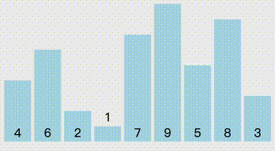
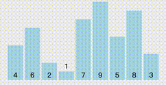
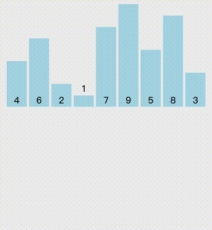
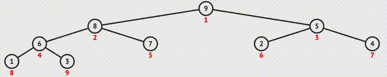
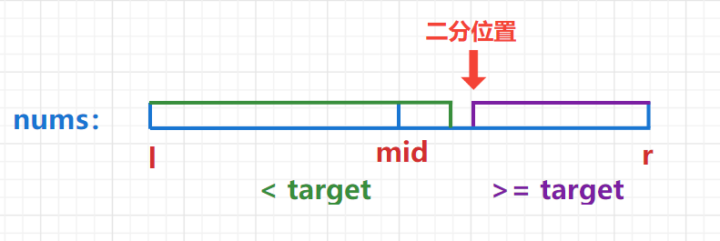
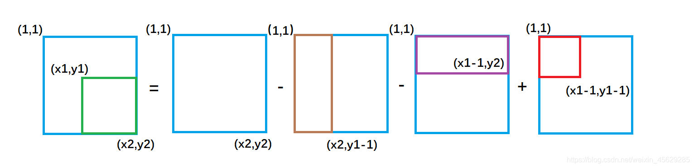

# 算法

## 排序算法

### 1. 冒泡排序

<div align=center> </div>

>  提前结束优化 :

当某一轮比较均未发生交换，说明排序已完成，可设置一个布尔值记录一轮排序是否有发生交换，若无则提前退出循环结束程序。

> 冒泡优化：

记录前一轮交换的最终位置，说明该位置之后的元素为已排序状态，下一轮的交换只需执行到该处。

+ 两个元素进行进行交换：

```cpp
void swap(vector<int>& arr, int i, int j) {
    int temp = arr[i];
    arr[j] = arr[i];
    arr[i] = temp;
}
```

```cpp
void bubble_sort(vector<int>& arr) {
    if (arr.size() < 2) return;
    int lastSwapIdx = arr.size() - 1;
    bool swapped = true;
    int swapIdx = -1;
    // lastSwapIdx表示前一轮交换的最终位置，即下标为lastSwapIdx是未排序部分中的最后一个数的下标，
    // 因此for中的界是i < lastSwapIdx而不需要写成i <= lastSwappedIdx
    while (swapped) {
        // 本轮执行是否有交换的标志，若无则true，若有则false
        swapped = false;
        // 每轮循环，通过依次向右比较两个数，将本轮循环中最大的数放到最右
        for (int i = 0; i < lastIndex; i++) {
             // 若左大于右则交换，并将swapped置为true
             if (arr[i] > a[i + 1]) {
                 swap(arr, i, i + 1);
                 swapped = true;
                 swapIdx = i;
             }  
        }
        lastSwapIdx = swapIdx;
    }
    return;
}
```

### 2. 选择排序

<div align=center> </div>

```cpp
void selectSort(vector<int>& arr) {
    if (arr.size() < 2) return;
    // n - 1 轮次执行,当前 n - 1 个元素排好后，最后一个元素无需执行，故 i < arr.size() - 1
    for (int i = 0; i < arr.size() - 1; i++) {
        int minIdx = i;
        // 找到本轮执行中最小的元素，将最小值下标赋值给min
        for (int j = i + 1; j < arr.size(); j++) {
            if (arr[minIdx] > arr[j]) {
                minIdx = j;
            }
        }
        // 若本轮第一个数字不是最小值，则交换位置
        if (minIdx != i) swap(arr, minIdx, i);
    }
    return;
}
```

### 3. 快速排序

<div align=center> </div>

```cpp
//快速排序可以取随机点作为分区点，一般取中间点。
void quick_sort(int q[], int l, int r) {
    if (l >= r) return; //递归边界
    int i = l - 1, j = r + 1, x = q[l + r >> 1]; //取中间点为分区点
    //这里的初值分别设为l-1，r+1是因为while中是do，while结构。先使i+1，j-1指向数组第一个和最后一个位置,再开始判断。
    while (i < j) {
        do i ++ ; while (q[i] < x);		//左边的数left <= x 
        do j -- ; while (q[j] > x);		//右边的数right >= x
        if (i < j) swap(q[i], q[j]); //交换
    }
    quick_sort(q, l, j), quick_sort(q, j + 1, r);  //递归左右子序列
}

```

关于边界问题的说明[点击](https://www.acwing.com/solution/content/34682/)

#### 快速选择算法

处理问题：数组中第K个最小/最大元素(快速选择算法)包含重复元素。

第K个最小的元素包含重复元素:

```cpp
/*
快排的每一趟，数轴的左边都会是<=x的，右边都是>=x的。
左边元素的个数是`s1 = j - l + 1`, 如果`k <= s1`的话，那吗下次递归时间区间就是在左边。否则在右边,右边遍历的区间为k - s1
*/
int quick_sort(int q[], int l, int r, int k){
    if(l == r) return q[l]; //最后只剩一个数时，只会有数组[k]一个数，返回数组[k]的值就是答案
    int x = q[(l + r) >> 1], i = l - 1, j = r + 1;
    while(i < j){
        do i ++ ; while (q[i] < x);		
        do j -- ; while (q[j] > x);
        if(i < j) swap(q[i], q[j]);
    }
    //这里为什么要取j，不可以取i，开始 i < j 进入循环 ， 然后 i++ 后 i == j 了 ，然后还要执行 j-- 所以这个时候 j 就 小于i 了。
    //去除sl的长度(分界点 - 左边界 + 1)
    int s1 = j - l + 1;
    if(k <= s1) return quick_sort(q, l, j, k);
    else return quick_sort(q, j + 1, r, k- s1);
}
```

时间复杂度是O(n)。

第K个最大元素包含重复元素:

```cpp
class Solution {
public:
    int quickSelect(vector<int>& nums, int l, int r, int k) {
        if (l == r) return nums[l];
        int i = l - 1, j = r + 1, x = nums[l + r >> 1];
        while (i < j) {
            do i ++; while (nums[i] > x);
            do j --; while (nums[j] < x);
            if (i < j) swap(nums[i], nums[j]);
        }
        int cnt = j - l + 1;
        if (k <= cnt) return quickSelect(nums, l, j, k);
        else return quickSelect(nums, j + 1, r, k - cnt);
    } 

    int findKthLargest(vector<int>& nums, int k) {
        //k传入的是不是下标
        return quickSelect(nums, 0, nums.size() - 1, k);
    }
};
```

### 4. 归并排序

<div align=center> </div>

模板：

归并排序的基本流程：

1、确定分界点`mid: l + r >> 1`;

2、递归排序左右区间(边界情况同快排)。

3、归并:把2个有序序列合并(用到双指针)

+ A：使用两个指针`i = l`，`j = mid + 1`指向2个数组头。
+ B：临时数组`temp[]`,指针`k = l`。
+ C：比较q[i], q[j],直到某个数组到头。
  + 若q[i] <= q[j]，则temp[k++] = q[i++]; 使用临时数组记录结果
  + 若q[i] <= q[j]，则temp[k++] = q[j++];
+ D：把数组剩余部分接到临时数组后。
+ E：把结果复制回原数组。

只能选中间点为分区点。

```cpp
void mergeSort(vector<int>& nums, vector<int>& tmp,int l, int r) {
        if (l >= r) return;
        int mid = (l + r) >> 1;
        mergeSort(nums, tmp, l, mid);
        mergeSort(nums, tmp, mid + 1, r);
        int k = l, i = l, j = mid + 1;
        while (i <= mid && j <= r) {
            if (nums[i] <= nums[j]) tmp[k++] = nums[i++];
            else tmp[k++] = nums[j++];
        }
        while (i <= mid) tmp[k++] = nums[i++];
        while (j <= r) tmp[k++] = nums[j++];
        for (int i = l; i <= r; i++) nums[i] = tmp[i];
        return; 
}
```

### 5. 堆排序

建堆：

输入数组{4, 6, 2, 1, 7, 9, 5, 8, 3} (1为最后一个非叶子结点) 堆化成大顶堆{9, 8, 5, 6, 7, 2, 4, 1, 3}的过程。

<div align=center> </div>

下滤：

展示了删除大顶堆{9, 8, 5, 6, 7, 2, 4, 1, 3}堆顶元素9的过程（动图中出现的100表示堆顶，值为9）。

删除堆顶，堆中元素减1，将当前最后一个元素3暂时置为堆顶。

可以看到，此时影响堆序的只有该堆顶元素3，于是交换其与左右子节点中的较大者。

对元素3重复操作2，直到3再无子节点，堆序恢复。

<div align=center> </div>

```cpp
void build_heap(vector<int>& nums) {
    int n = nums.size();
    //最后一个非叶子节点（也即最后一个元素的父节点）下标为 (n - 1) / 2，n为数组长度。
    for (int i = (n - 1) / 2; i >= 0; i--) {
        heapify(nums, i, n);
    }
}

void heapify(vector<int>& nums, int u, int len) {
    int t = u;
    if (2 * u + 1 < len && nums[t] > nums[2 * u + 1]) t = 2 * u + 1;
    if (2 * u + 2 < len && nums[t] > nums[2 * u + 2]) t = 2 * u + 2;
    if (t != u) {
        swap(nums[t], nums[u]);
        heapify(nums, t, len);
    }
    return;
}
vector<int> sortArray(vector<int>& nums) {
    int len = nums.size();
    build_heap(nums);
    vector<int> res;
    for (int i = 0; i < nums.size(); i++) {
        res.push_back(nums[0]);
        nums[0] = nums[len - 1];
        len--;
        heapify(nums, 0, len);
    }
    return res;
}
```

### 6. 排序算法的时间复杂度分析

**排序的稳定性：**是相等元素在原输入数组中的相对位置，在排序后不变，否则排序不稳定。

1. 冒泡排序

时间复杂度：两层 `for`循环，第 1 轮比较 `n - 1`次 `(n = arr.size())`，最后一轮比较 1 次。总比较次数为 `n*(n - 1) / 2`次，时间复杂度为` O(n^2)`。当输入数组为已排序状态时，在应用提前结束优化的情况下，只需一轮比较，此时为最佳时间复杂度 `O(n)`。

空间复杂度：算法中只有常数项变量，`O(1)`。

稳定性:冒泡排序始终只交换相邻元素，比较对象大小相等时不交换，相对位置不变，故稳定。

2. 选择排序

时间复杂度：两层`for`循环，第1轮比较` n - 1 `次`(n = arr.size())`，最后一轮比较1次。总比较次数为 `n*(n - 1) / 2`次，时间复杂度为 `O(n 
^2)`。

空间复杂度：算法中只有常数项变量，O(1)。

稳定性:不稳定，存在跨越交换。找到本轮次最小值之后，将其与本轮起始数字交换，此时若中间有与起始元素同值的元素，将打破稳定性。

例:　7 7 2 。第一轮交换第一个7和2，则两个7位置关系改变。

3. 快速排序

时间复杂度：平均 / 最好为 `O(nlogn)`，最坏为 `O(n^2)`。

空间复杂度：递归形式的快排，取决于递归深度，为 `O(logn)`。非递归形式的快排，保存分区信息的栈深度与递归深度相同，空间复杂度也是 `O(logn)`。

稳定性:不稳定，partition中在确定了主轴位置后，将一开始设置的主轴元素与最后一个小于主轴的元素x交换时，若中间有与x同值的元素，则稳定性被破坏。

例：7 2 4 7 1 9

4为主轴元素，partition过后交换7和1，则两个7的位置关系发生变化。

4. 归并排序

时间复杂度：`O(nlogn)`。

空间复杂度：`O(n)`。

稳定性：稳定，合并时的此判断中的等号`if(left[l_next] <= right[r_next])`，保证了出现相等元素时，居左的元素总会被放在左侧，稳定性不受影响。

5. 堆排序

时间复杂度：原地堆排序的时间复杂度为 `O(nlogn)`。

循环  `n -1` 次，每次都是从根节点往下循环查找，所以每一次时间是 `logn`，总时间：`logn(n-1) = nlogn  - logn`。

建堆时间复杂度：`O(n)`。

空间复杂度：`O(1)`。

稳定性：不稳定。

## 二分算法

### 1. 整数二分

二分法查找下边界（查找满足条件的最左边界）：

+ 1、二分范围,`l = 0`,` r = nums.size() - 1`,我们去二分查找>= target的最左边界

+ 2、当`nums[mid] >= target`时，往左半区域找,`r = mid`。

+ <div align=center> </div>

+ 3、当`nums[mid] < target`时,往右半区域找，`l = mid + 1`;

<div align=center> </div>

+ 4、如果` nums[l] != target`，说明数组中不存在目标值 `target`，返回 `[-1, -1]`。否则我们就找到了第一个`>=target`的位置`L`。

二分法查找上边界(查找满足条件的最右边界)：

+ 1、二分的范围，`l = 0`，`r = nums.size() - 1`，我们去二分查找`<=target`的最右边界。
+ 2、当`nums[mid] <= target`时，往右半区域找，`l = mid`。

<div align=center> </div>

- 3、当`nums[mid] > target`时， 往左半区域找，`r = mid - 1`。

<div align=center> </div>

- 4、找到了最后一个`<=target`的位置`R`。

> 如果mid=(l+r+1)/2,那么这时候区间一定是[l,mid-1]和[mid,r],如果是[l,mid]和[mid+1,r]就有可能导致前面的长度比后面的大2，eg:l=1,r=8 mid=5;这样区间就是[1,5]和[6,8]，前面长度是5后面长度是3还谈什么二分？更过分的情况是l=1，r=2时区间划分为了[1,2]和[]区间并没有划分小，所以是不可以使用的。另一个使用条件可用同样的方法证明。

```cpp
bool check(int x) {/* ... */} // 检查x是否满足某种性质

// 区间[l, r]被划分成[l, mid]和[mid + 1, r]时使用：
int bsearch_1(int l, int r) {
    while (l < r) {
        int mid = (l + r) >> 1;
        if (check(mid)) r = mid;    // check()判断mid是否满足性质
        else l = mid + 1;
    }
    return l;
}
// 区间[l, r]被划分成[l, mid - 1]和[mid, r]时使用：
//+1是因为除法下取整，在r = l + 1时更新l = mid时会出现l = mid = l的死循环。+1则相当于上取整，解决了这个隐患
int bsearch_2(int l, int r) {
    while (l < r) {
        int mid = (l + r + 1) >> 1;
        if (check(mid)) l = mid;
        else r = mid - 1;
    }
    return l;
}
```

### 2. 浮点型二分

 ```cpp
 bool check(double x) {/* ... */} // 检查x是否满足某种性质
 
 double bsearch_3(double l, double r) {
     const double eps = 1e-6;   // eps 表示精度，取决于题目对精度的要求
     while (r - l > eps) {
         double mid = (l + r) / 2;
         if (check(mid)) r = mid;
         else l = mid;
     }
     return l;
 }
 ```

## 双指针算法

### 1. 快慢指针

需要两个指针，开始都指向开头，根据条件不同，快指针走得快，慢指针走的慢，直到满足条件或者快指针走到结尾。

### 2. 碰撞指针

需要两个指针，一个指向开头，一个指向末尾，然后向中间遍历，直到满足条件或者两个指针相遇。

### 3. 后序指针

对于合并和替换类型题，防止之前的数据被覆盖，双指针需从后向前遍历。

### 4. 滑动窗口

滑动窗口四连问：

**1.增大窗口时，要更新窗口内的什么数据？**

**2.什么时候窗口要缩小（shrink）？**

**3.窗口缩小时，更新窗口内的什么数据？**

**4.什么时候更新结果**

#### 1) 最长模板

```cpp
初始化left，right，result，bestResullt
while (右指针没有到结尾) {
    窗口扩大，加入right元素，更新当前的result
    while (result不满足要求) {
    	窗口缩小，移除left元素，left右移
    }
    更新最优结果bestResult
    right++;
}
返回bestResult
```

#### 2) 最短模板

```cpp
初始化left，right，result，bestResullt
while (右指针没有到结尾) {
    窗口扩大，加入right元素，更新当前的result
    while (result满足要求) {
    	更新最优结果bestResult
        窗口缩小，移除left元素，left右移
    }
    right++;
}
返回bestResult
```

## 位运算

### 1. 常用技巧

+ 求n的第k位数字是否为1 还是 0：`(n >> k) & 1`。

+ 求一个数，二进制的每一位所在位置。

```cpp
for (int i = 0; i < 32; i++) {
    if (((x >> i) & 1) {
        cnt[i]++;
    }
}
```

+ 找当前数字的最高位

```cpp
int s = -1;
for (int i = 31; i >= 0; i--) {
    if (((num >> i) & 1) != 0) {
        s = i;
        break;
    } 
}
```

+ 最高位以后全取1

```cpp
int count = 0;
for (int i = s; i >= 0; i--) {
    count |= 1 << i;
}
```

### 2. `n & (n - 1)`

作用:消除数字n二进制中最后一个1。

<div align=center> </div>

一个数如果是 2 的指数，那么它的二进制表示一定只含有一个 1：

```cpp
2^0 = 1 = 0b0001
2^1 = 2 = 0b0010
2^2 = 4 = 0b0100
```

### 3. `lowbit(x)`

作用：返回x的最后一位的大小。

```cpp
x = 0b1010 lowbit(x) = 0b10
x = 0b101000 lowbit(x) = 0b1000
/*数减去lowbit(数)
    等价于
 将这个数的二进制最低位的1抹零。*/
例如：
    int a = 5;
	int countOne = 0;
    while(a) {
       	a -= lowbit(a);  
    }
① a = 5 - 1;
② a = 4 - 4;
```

## 快速幂

快速计算a^b^:时间复杂度(n * logb)

```cpp
(ab) % c = (a % c * b % c) % c;
a = p1 * c + q1;
b = p2 * c + q2;
a % c = q1;
b % c = q2;
a * b = (....)c + q1q2;
(a * b) % c = (q1q2) % c;
* 和 %在同一个运算优先级上
long long quick_pow(long long a, int b, int p) {
    long long res = 1;
    while (b) { //对b进行二进制化，从低位到高位
        //如果b的二进制表示的第0位为1，则乘上当前的a
        if (b & 1) res = (res * a)% p;
        //更新a,a依次为a^{2^0},a^{2^1},a{2^2},......,a^{2^logb}
        a = (a * a) % p;
        //b右移一位
        b >>= 1;
    }
    return res;
}
```

## 深度优先搜索

### 1. 回溯

+ 组合问题：N个数里面按一定规则找出k个数的集合。

+ 切割问题：一个字符串按一定规则有几种切割方式。

+ 子集问题：一个N个数的集合里有多少符合条件的子集。

+ 排列问题：N个数按一定规则全排列，有几种排列方式。

+ 棋盘问题：N皇后，解数独等等。

回溯搜索的遍历过程：

<div align=center> </div>

回溯模板：

```cpp
void backtracking(参数) {
    if (终止条件) {
        存放结果;
        return;
    }
    for (选择：本层集合中元素（树中节点孩子的数量就是集合的大小）) {
        处理节点;
        backtracking(路径，选择列表); // 递归
        回溯，撤销处理结果
    }
}
```

**要是结果是`true` 或者 `false`，则返回值使用`bool`**。

#### 1) 组合和排列

**组合是不强调元素顺序的，排列是强调元素顺序**。

> 78 子集
>
> 给的案例无重复数字
>
> 注重点：取完数组中的当前元素，都要从数组的下一个元素开始去，`startIndex = i + 1`;
>
> 90 子集II
>
> 给的案例有重复数字
>
> 注重点：1、有重复数字需要sort(); 2、使用visited数组，我们要对同一树层使用过的元素进行跳过。
>
> 46 全排列
>
> 给的案例没有重复数字
>
> 注重点：我们每次从头开始取，已经有了的就不要了。每次的循环起点从i = 0开始。
>
> 47 全排列II
>
> 给的案例有重复数字
>
> 注重点：1、有重复数字需要sort(); 2、当前位置元素与前一个位置元素相同，前一个元素还没被使用，说明同一树层有两个相同元素跳过。
>
> 77 组合
>
> 相当于数字4个球取2个有几种取法。

###  2. 网格`DFS`框架

#### 1) 无返回值的网格深搜框架

```cpp
void dfs(vector<vector<int>>& grid, int row, int col) {
     // 判断 base case
    if (!inArea(grid, row, col)) {
        return;
    }
    // 如果这个格子不是岛屿，直接返回
    if (grid[row][col] != 1) {
        return;
    }
    grid[row][col] = 2; // 将格子标记为「已遍历过」
     // 访问上、下、左、右四个相邻结点
  	dfs(grid, row - 1, col);
    dfs(grid, row + 1, col);
    dfs(grid, row, col - 1);
    dfs(grid, row, col + 1);
    return;
}
bool inArea(vector<vector<int>>& grid, int row, int col) {
    return row >= 0 && row < grid.size() && col >= 0 && col < grid[0].size();
}
```

#### 2)有返回值的深搜框架

```cpp
int dfs(vector<vector<int>>& grid, int row, int col) {
     // 判断 base case
    if (!inArea(grid, row, col)) {
        return 0;
    }
    // 如果这个格子不是岛屿，直接返回
    if (grid[row][col] != 1) {
        return 0;
    }
    grid[row][col] = 2; // 将格子标记为「已遍历过」
     // 访问上、下、左、右四个相邻结点
    return 1 + dfs(grid, row - 1, col) +  dfs(grid, row + 1, col) + dfs(grid, row, col - 1) + dfs(grid, row, col + 1);
}
bool inArea(vector<vector<int>>& grid, int row, int col) {
    return row >= 0 && r < grid.size() && c >= 0 && c < grid[0].size();
}
```


## 广度优先搜索

## 数学知识

### 1. 求模%

如果a 与d 是整数，d 非零，那么余数 r 满足这样的关系：`a = qd + r` , `q` 为整数，且`0 ≤ |r| < |d|`。取余的结果就会导致出现两个余数了，比如`5%(-3)` = `(-3)x(-1)+2` = `(-3)x(-2)-1`，所以这里的余数`2`和`-1`都满足定义。
我们把`2`称为正余数，`-1`成为负余数。通常，当除以`d` 时，如果正余数为`r1`，负余数为`r2`，那么有`r1 = r2 + d`。

<font size = 5>**所有语言和计算器都遵循了尽量让商尽量靠近0的原则，即5%(-3) 的结果为2而不是-1，(-5)%3的结果是-2而不是1。**</font>

**n % p 得到结果的正负由被除数n决定,与p无关。例如：7%4 = 3， -7%4 = -3， 7%-4 = 3， -7%-4 = -3。**

模的运算公式：

```cpp
1. (a + b) % p = (a % p + b % p) % p 
2. (a - b) % p = (a % p - b % p ) % p 
3. (a * b) % p = (a % p * b % p) % p 
将所有数变成K对应的余数
通用方式：(num % K + K) % K [不用区分正负数]----974、和可被K整除的子数组
```

## 前缀和和差分

### 1. 一维前缀和
概念：前缀和 Si为数组的前 i项和。
作用：快速求出原数组中某段区间的和。
**注意：**前缀和的下标一定从1开始，避免进行下标的转换。切记！切记！

> s[0] = 0;
>
> s[1] =  a[1];
>
> s[2] = a[1] + a[2];

处理边界问题：要定义S~0~ = 0,这样就不用特判了。S~10~-S~0~,这样就可以求出前10个数的和。
模板：

```cpp
/*
所求的vector<int> nums前缀和。
vector<int> sum(nums.size() + 1, 0);
nums:2 3 2 1 5 6
preSum: 0 2 5 7 8 13 19
*/
for (int i = 0; i < nums.size(); i++) {
    sum[i + 1] = sum[i] + nums[i];
}

for (int i = 1; i <= nums.size(); i++) {
    for (int j = 0; j < i; j++) {
        //处理逻辑
    }
}
```
当算法题的背景是整数型数组出现<font color='red'>子数组和</font>或者<font color='red'>连续的子数组</font>既可以考虑使用前缀和来求解会得到不错的效果。
前缀和运用在常用的考点中：

+ 2数之和系列(560、974、523、525、1248)
+ 范围和(370)
+ 滑动窗口
+ 单调队列

模板：

```cpp
class Solution {
public:
    int subarraySum(vector<int>& nums, int k) {
        unordered_map<int,int> mp = {{0,1}};  //初始值， 如果是求个数， 代表个数就是1， 如果是求长度， 代表index 为-1
        int ans = 0;
        int sum = 0;

        for(auto& a : nums) {
            sum += a;             //根据题意有变化，比如奇数个数的1248题。
            int cur = sum - k;    //cur值根据题意进行改变， 求和是sum-k，求倍数就是 sum % k
            if(mp.count(cur)){
                ans += mp[cur];
            }
            mp[sum]++;  //mp[cur或者sum]根据题意改变， 求长度就是sum的index， 求个数，一般要变化为cur的old个数++。
        }
        return ans;
    }
};
```

### 2. 二维前缀和
二维前缀和的含义
1、`s[i][j]`的含义：在i, j左上角所有数的和。

2、前缀和的预处理公式
整个外围蓝色矩形面积`s[i][j]` = 绿色面积`s[i-1][j]` + 紫色面积`s[i][j-1]` - 重复加的红色的面积`s[i-1][j-1]`+小方块的面积`a[i][j]`;
前缀和的预处理公式：`s[i][j] = s[i-1][j] + s[i][j-1] + a[i][j] - s[i-1][j-1]`。
3、求以`(x1, y1)`为左上角和以`(x2, y2)`为右下角的矩阵元素和。

绿色矩形的面积 = 整个外围面积`s[x2, y2]` - 黄色面积`s[x2, y1 - 1]` - 紫色面积`s[x1 - 1, y2]` + 重复减去的红色面积 `s[x1 - 1, y1 - 1]`。
二维前缀和公式：`s[x2, y2] - s[x1 - 1, y2] - s[x2, y1 - 1] + s[x1 - 1, y1 - 1]`。

```cpp
//预处理前缀和数组
sum.resize(n + 1, vector<int>(m + 1, 0));
// 预处理除前缀和数组（模板部分)
for (int i = 1; i <= n; i++) {
    for (int j = 1; j <= m; j++) {
        // 当前格子(和) = 上方的格子(和) + 左边的格子(和) - 左上角的格子(和) + 当前格子(值)【和是指对应的前缀和，值是指原数组中的值】
        sum[i][j] = sum[i - 1][j] + sum[i][j - 1] - sum[i - 1][j - 1] + matrix[i - 1][j - 1];
    } 
}
// 首先我们要令左上角为 (x1, y1) 右下角为 (x2, y2)
// 计算 (x1, y1, x2, y2) 的结果
{
    // 前缀和是从 1 开始，原数组是从 0 开始，上来先将原数组坐标全部 +1，转换为前缀和坐标
    x1++; y1++; x2++; y2++;
    // 记作 22 - 12 - 21 + 11，然后 不减，减第一位，减第二位，减两位
    // 也可以记作 22 - 12(x - 1) - 21(y - 1) + 11(x y 都 - 1)
    ans = sum[x2][y2] - sum[x1-1][y2] - sum[x2][y1-1] + sum[x1-1][y1-1];
	
}
S[i] = a[1] + a[2] + ... a[i]
a[l] + ... + a[r] = S[r] - S[l - 1]
S[i, j] = 第i行j列格子左上部分所有元素的和
以(x1, y1)为左上角，(x2, y2)为右下角的子矩阵的和为：
S[x2, y2] - S[x1 - 1, y2] - S[x2, y1 - 1] + S[x1 - 1, y1 - 1]
```
### 3. 一维差分
原数组`a`：`a[1],a[2],,,,,,,,a[n];`
构造数组`b`：`b[1],b[2],,,,,,,,b[i];`
使得`a[i] = b[1] + b[2] + b[3] +,,,,,,,,,,,+ b[i]`
`a`数组是`b`数组的前缀和数组，反过来`b`数组是`a`数组的差分数组。
```cpp
a[0] = 0;
b[1] = a[1] - a[0];
b[2] = a[2] - a[1];
b[3] = a[3] - a[2];
........
b[n] = a[n] - a[n-1];
```


`b[l] + c`，效果使得`a`数组中 `a[l]`及以后的数都加上了`c`(红色部分)，但我们只要求`l`到`r`区间加上`c` ,因此还需要执行` b[r+1] - c`,让`a`数组中`a[r+1]`及往后的区间再减去`c`(绿色部分)，这样对于`a[r] `以后区间的数相当于没有发生改变。
因此我们得出一维差分结论：给`a`数组中的`[l, r]`区间中的每一个数都加上`c`,只需对差分数组`b`做` b[l] += c`, `b[r+1] -= c`。时间复杂度为`O(1)`, 大大提高了效率。
```cpp
#include<iostream>
using namespace std;
const int N = 1e5 + 10;
int a[N], b[N];
int main()
{
    int n, m;
    scanf("%d%d", &n, &m);
    for (int i = 1; i <= n; i++)
    {
        scanf("%d", &a[i]);
        b[i] = a[i] - a[i - 1];      //构建差分数组
    }
    int l, r, c;
    while (m--)
    {
        scanf("%d%d%d", &l, &r, &c);
        b[l] += c;     //将序列中[l, r]之间的每个数都加上c
        b[r + 1] -= c;
    }
    for (int i = 1; i <= n; i++)
    {
        a[i] = b[i] + a[i - 1];    //前缀和运算
        printf("%d ", a[i]);
    }
    return 0;
}
```

### 4. 二维差分

二维差分含义：二维数组被选中的子矩阵中的每个元素的值加上`c`,是否也可以达到`O(1)`的时间复杂度。
`a[][]`数组是`b[][]`数组的前缀和数组，那么`b[][]`是`a[][]`的差分数组。
已知原数组`a`中被选中的子矩阵为 以`(x1,y1)`为左上角，以`(x2,y2)`为右下角所围成的矩形区域。
**始终要记得，a数组是b数组的前缀和数组**，比如对`b`数组的`b[i][j]`的修改，会影响到`a`数组中从`a[i][j]`及往后的每一个数。


`b[x1][y1] +=c `; 对应图1 ,让整个a数组中蓝色矩形面积的元素都加上了c。
`b[x1][y2+1] -=c `; 对应图2 ,让整个a数组中绿色矩形面积的元素再减去c，使其内元素不发生改变。
`b[x2+1][y1] -=c `; 对应图3 ,让整个a数组中紫色矩形面积的元素再减去c，使其内元素不发生改变。
`b[x2+1][y2+1] +=c`; 对应图4,让整个a数组中红色矩形面积的元素再加上c，红色内的相当于被减了两次，再加上一次c，才能使其恢复。

```cpp
封装成一个插入函数
void insert(int x1, int y1, int x2, int y2, int c) {
    b[x1][y1] += c;
    b[x2+1][y1] -= c;
    b[x1][y2+1] -= c;
    b[x2+1][y2+1] += c;
}
```
二维差分构造方法:
```cpp
b[i][j] = a[i][j] - a[i - 1][j] -a[i][j - 1] + a[i - 1][j - 1];
```

